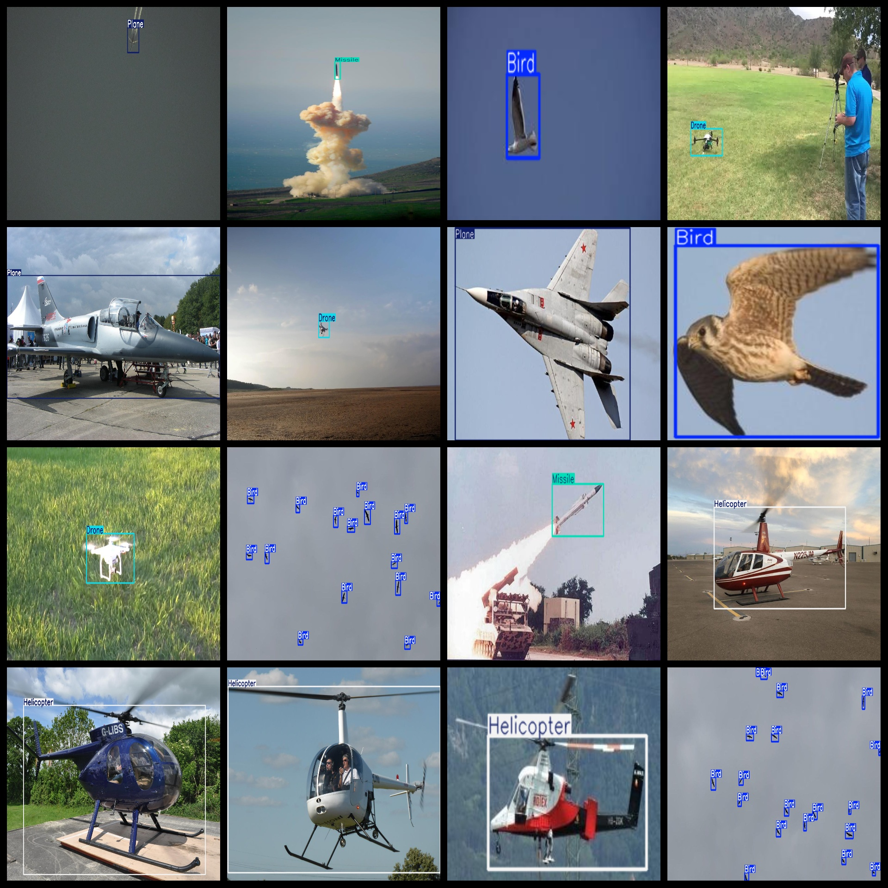
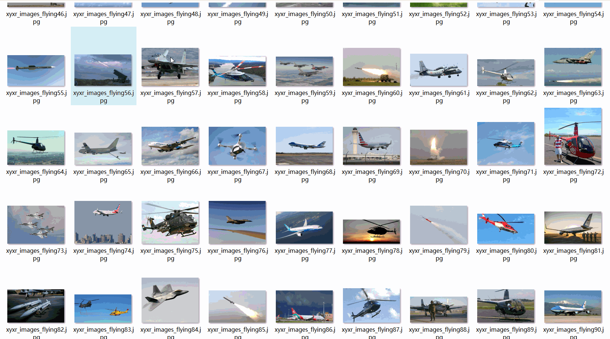

# 5 Types Aerial Flying Object Dataset: 3936 Images in VOC+YOLO Format

This dataset contains 5 types of aerial flying objects, comprising 3936 images in VOC+YOLO format. It consists of three folders for storing images, xml files, and txt files. The JPEGImages folder contains a total of 3936 jpg images. The Annotations folder features a total of 3936 xml files. The labels folder has a total of 3936 txt files. There are 5 types of labels: "Bird", "Drone", "Helicopter", "Missile", and "Plane". Each label has its own number of boxes (the yolo format class order does not correspond to this, but it is based on the classes.txt in the labels folder).

The number of boxes for each label is as follows:
- Bird: 3082
- Drone: 1356
- Helicopter: 916
- Missile: 822
- Plane: 970
- Total boxes: 7146

The image resolutions are all clear. The images have not been enhanced. The GitHub repository location is datasets_sl. The labels are in the form of rectangular boxes, used for object detection recognition.

Important Note: No guarantees are made regarding the accuracy or precision of the models trained on this dataset or the weight files. The dataset only provides accurate and reasonable annotations.

Annotation and Image Details:

## Images

---

Here is a pay link on Stripe (https://buy.stripe.com/3cs8yP7sY87d0vu9AB). Please contact me lonlonago@foxmail.com after funding $89, and I will send you a complete data files, thank you!

